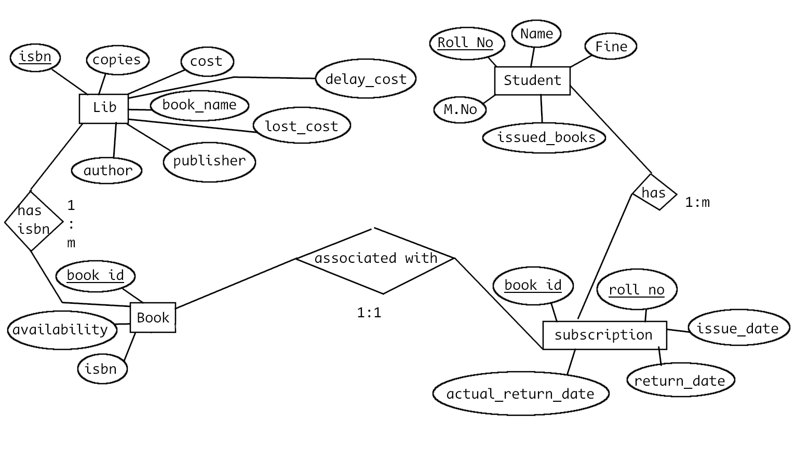

## Don't make any change to library_read_only.sql

Formatted outputput of Library.sql is put in library_read_only.sql

### Command to format Library.sql into library_read_only.sql

```
sqlformat -i "lower" -k "upper" -o "library_read_only.sql" Library.sql

```

### Install sqlformat first

```
sudo apt install sqlformat

```

# ER diagram

